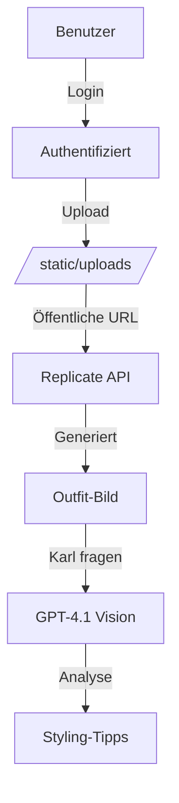

# Sicherheitskonzept OutfitSnap

## 🔐 HTTP-Zugangsschutz

### Geschützte Bereiche:
- ✅ `/` - Hauptseite (Upload-Interface)
- ✅ `/result` - Ergebnisseite
- ✅ `/status/<id>` - Prediction-Status
- ✅ `/api/chat` - Karl-KI-Beratung
- ✅ `/video/create`, `/video/status/<id>` - Video-Generierung (kostenpflichtige Replicate-Aufrufe)
- ✅ `/search/amazon` - Amazon-Produktsuche
- ✅ `/admin/*` - Admin-Bereich

### Öffentliche Bereiche (wichtig für Funktionalität):
- ✅ `/static/` - Statische Dateien (CSS, JS, Bilder)
- ✅ `/static/uploads/` - Hochgeladene Bilder (für Replicate API)
- ✅ `/static/persons/` - Avatar-Bilder
- ✅ `/login` - Login-Seite
- ✅ `/logout` - Logout-Funktion

## 🌐 Externe API-Zugriffe

### Replicate API Zugriff:
```
https://your-app.railway.app/static/uploads/bild123.jpg
```
- ✅ **Erreichbar**: Keine Authentifizierung erforderlich
- ✅ **Sicher**: Nur zufällige UUIDs als Dateinamen
- ✅ **Temporär**: Bilder können nach Zeit gelöscht werden

### Gen-4 Bildgenerierung:
1. Benutzer lädt Bilder hoch → `/static/uploads/`
2. Flask generiert öffentliche URLs → `url_for('static', filename='uploads/xyz.jpg')`
3. Replicate Gen-4 greift auf öffentliche URLs zu ✅
4. Generiertes Bild wird zurückgegeben ✅

### Karl Vision-Analyse:
1. Gen-4 erstellt Outfit-Bild auf Replicate-Servern
2. Frontend sendet Replicate-URL an `/api/chat` (geschützt)
3. GPT-4.1 Vision analysiert Replicate-URL ✅
4. Keine lokalen Bilder betroffen

## 🔑 Authentifizierung

### Anmeldedaten:
- **Benutzername**: via `AUTH_USERNAME` (Standard: `admin`)
- **Passwort**: via `AUTH_PASSWORD` – es gibt **kein** Standard-Passwort; ohne Variable ist der Login deaktiviert

### Session-Management:
- Flask-Sessions mit `SECRET_KEY` (ohne Variable: zufälliger Schlüssel pro Start)
- Automatische Weiterleitung zu `/login` bei fehlendem Zugriff
- Logout löscht Session

### Feed-API:
- `/api/feed/export` und `/api/feed/changed` erfordern `FEED_API_TOKEN` (Header `X-Feed-Token` oder `?token=`)
- Ohne gesetzten Token ist die Feed-API gesperrt

## ⚠️ Sicherheitshinweise

### Produktions-Setup:
1. `SECRET_KEY`, `SESSION_SECRET` und `SSO_SHARED_SECRET` mit langen Zufallswerten setzen
2. `AUTH_PASSWORD` auf sicheres Passwort setzen
3. `FEED_API_TOKEN` setzen, falls die Feed-API genutzt wird
4. Optionale IP-Beschränkung über Railway/Proxy

### Datenschutz:
- Hochgeladene Bilder haben zufällige UUID-Namen
- Keine Speicherung von Benutzerdaten
- Sessions nur für Authentifizierung

## 🔄 Workflow-Sicherheit



**Fazit**: Alle Funktionen bleiben voll funktionsfähig! 🎯
